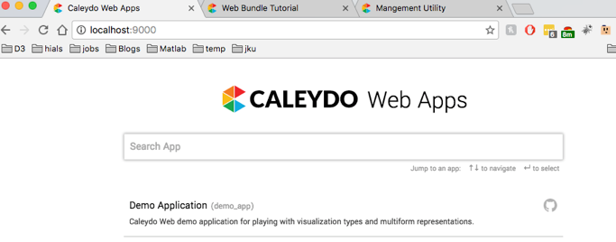
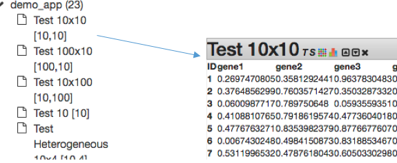
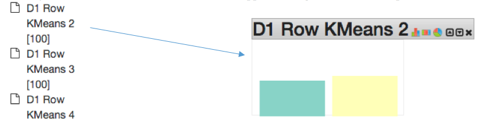
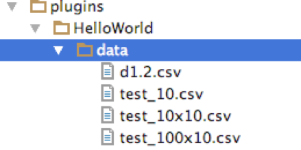
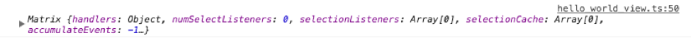
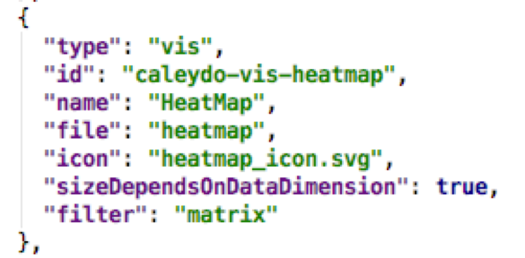
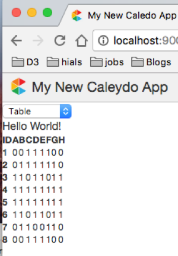
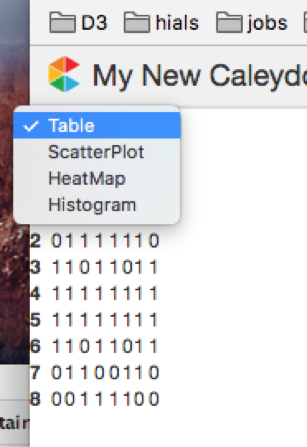
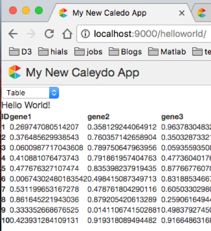

#### Starting up Vagrant
Locate to the caleydo web container and fire up the terminal follow steps:

`Vagrant ssh` 

Then 

`grunt watch_server`


This will run the server and indexes are updated. It will also activate the apache process. Do not exit the tab which will terminate all the running process on the server including your apache and other background services.

The localhost can be obtained from:

`http://localhost:9000/`

The next step is to pull the caleydo_sample_app from github.  For this first locate caleydo web container (outside vagrant server) and open the terminal then paste the following command.

`./manage.sh clone caleydo_sample_app`

So everything if you want to clone or pull you need to run the manage script as in step above. The files will be downloaded inside the `“plugins ->caleydo_sample_app”`. The other helping files for different purpose like loading data, visualization… are inside the plugins folder.

Then open the browser you should see: 





Inside the caleydo_sample_app there are already a tons of different data sets for different kind of visualization which you can play around. Depending on the type of data set and meta information provided, calayedo framework can show up the different kind of visualization supported for that data automatically.
The supported visualizations in caleydo framework `(plugins -> caleydo_vis ->package.json)` are:

1.	Barplot
2.	Raw table 
3.	Scatter plot
4.	Heatmap
5.	Kaplanmeier
6.	Histogram
7.	Mosaic
8.	Pie chart
9.	Boxplot
10.	Force directed graph.


####	Example how to use caleydo_sample_app:
Drag Test 10x10[10,10] to the workspace then you can see as shown in figure.





This data supports Raw Table view, Heatmap and Bar chart only.

If we try another data set D1 Row Kmeans 2, it supports histogram, mosaic, and pie chart.




All data are located in data folder of your caleydo_sample_app.


#### Building your hello world.

Open the terminal and paste.

`./manage.sh init_app`

Enter the name of plugin `“helloworld”`.

Then the server will make hello world with necessary plugins already loaded. The next step to compile the typescripts files. It can be done by using following command

`./manage.sh server  or simply update the package in pycharm`


Then you can see the helloworld in your browser.

`http://localhost:9000/helloworld/`

#### Loading data.
Create folder data inside your helloworld folder and upload your data (CSV,TSV) there as shown in figure.





Now you need to create `index.json` to communicate with the server so that server can do re-indexing for your project. Make empty `index.json` and put inside data folder.

`Read data`

To use the server to read your data put the following code in recently created `index.json` and save it.


```javascript

```
 
 We need to re-initialize the server to re-index. So you need to restart the server. You can simply stop the server by pressing ctrl+c. 
Now reinitialize the server type:

`grunt watch_server`

Then you should be able to see your app on 

`http://localhost:9000/caleydo_sample_app/`  as shown in


Then you can drag the data on the workspace and play around.
Now if you want to see the different kind of visualization for your data supported go to the 

`caleydo_sample_app > data > index.json`

Then try to see how the different data format uses different visualization.

Now you can use the visualization for your data in anywhere. You do not need to worry about preparing the format of data for the caleydo framework. Just put your csv or tsv inside data and update the index.json accordingly. The server should be able to do all necessary operation for you.


#### Using the caleydo framework with test matrix data.
Now we will demonstrate how we can display the custom data in helloworld plugin.
Go to 

`helloworld -> hello_world_view.ts` 

Copy and paste the following inside the init() method after 

`this.$node.append('div').text(Language.HELLO_WORLD);`this line.


```javascript

```
You will get error saying cannot find name parser and multiform. Now we need to import parser and multiform to represent the matrix in caleydo format in order to use visualization.
Add these two lines:

`import parser = require('../caleydo_d3/parser');
import multiform = require('../caleydo_core/multiform');`

Now see the console you should be able to read your matrix.





Now the next step is to add visualization support for the data which is in matrix format. Caleydo requires different form of data format for different visualization representation. The details of what kind of data format is required for what kind of visualization can be obtained from 
`Caleydo_vis -> package.json`





For example, in order to add heatmap in your visualization the data format must be in matrix format. So information for another vis can be obtained from `package.json`.

Our next step is to add visualization.
Copy and paste the following code after the matrix initiation. 

```javascript

```

Here `initialVis` mean what kind of visualization should be loaded at the beginning. In this case the table will be loaded. The next advantage of caleydo, it can automatically show the different kind of visualization support for matrix data.
You will see the output in your helloworld as :




Now you can see the table is loaded at the beginning. From drop down you can see that for matrix data scatter plot, heat map and histogram are supported.





Now try changing `initialVis` to scatterplot. Then scatterplot will be loaded first.


#### Loading custom data from CSV.
We can load data in two different ways using d3 library and ajax call.
First import these two library 

`import data = require('../caleydo_core/data');`

Now copy and paste the following code in init() .

`Load Data` 

Copy and paste the following code inside init().

```javascript

```
`Preparing data for visualization`

Copy and paste the following code after you load the data.


```javascript

```

Hence you should be able to see your visualization as shown:



